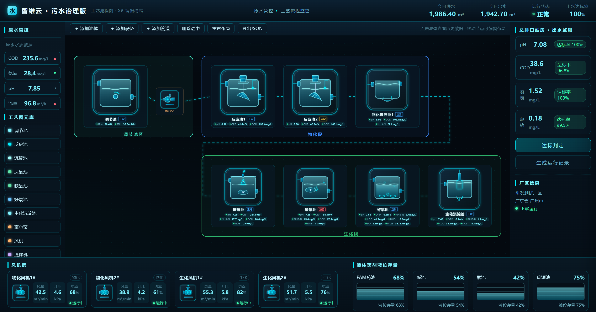

# 工艺流程编辑页（X6）· 工业污水处理过程可视化

> 面向工业污水处理场景的**工艺流程可视化 + 可编辑**大屏交互原型。
> 基于 AntV X6 图编辑引擎，支持工艺池体拖拽编排、动态水流线、池体状态展示、点击查看双数据源历史曲线。



## 功能特性

- **工艺流程可视化大屏**：原水管控 → 物化段（调节池 → 离心泵 → 反应池 → 沉淀池）→ 生化段（厌氧池 → 缺氧池 → 好氧池 → 生化沉淀池）全流程图形化展示
- **三色分区**：调节池区（青绿）/ 物化段（蓝）/ 生化段（绿），分区框随池体布局**自适应缩放**，新增池体自动进入对应分区并扩大分区框
- **可编辑画布**：
  - 从左侧图元库点击添加池体/设备，节点可自由拖动
  - 「＋添加管道」进入连线模式，自定义连接各工艺单元，生成流动虚线
  - 删除节点（选中 Delete / hover 显示 × 按钮）、重置布局、导出 JSON
- **SVG 工艺图元动画**：好氧池曝气气泡上升、立式双曲面搅拌机桨叶 3D 旋转、厌氧/缺氧池三叶螺旋桨（带导流罩）立体旋转、沉淀池刮泥机摆动
- **池体状态标识**：每个工艺池名称旁显示状态框（蓝=正常 / 黄=异常 / 红=预警）
- **点击池体查看详情**：弹出数据抽屉，展示该池各参数（pH / ORP / NH3-N / COD / NO3- / DO / MLSS 等）的**双数据源对比曲线**
  - 青色连续曲线 = 过程监测设备（高频）
  - 橙色散点 = 化验室数据（离散上传）
  - 支持近 24 小时 / 近 7 天 / 近 30 天时间范围切换，附化验室数据对比表
- **配套信息区**：顶栏（今日进出水量、运行状态、出水达标率）、左栏（原水水质数据）、风机房（物化/生化风机各 2 台）、液体药剂液位存量（PAM/碱/酸/碳源）、总排口出水监测与达标判定

## 快速开始

纯静态页面，无需构建、无需安装依赖，双击 `index.html` 即可在浏览器中打开。

> 依赖 CDN：AntV X6 v2、ECharts 5（需联网加载）。

```bash
# 或本地起一个静态服务
python -m http.server 8080
# 访问 http://localhost:8080
```

## 目录结构

```
X6工艺流程编辑/
├── index.html            # 大屏布局 + 页面入口
├── css/
│   └── style.css         # 大屏样式（三栏布局、状态框、动画）
├── js/
│   ├── svg-assets.js     # SVG 工艺图元资产（调节池/反应池/厌氧池等）
│   ├── mock-data.js      # 模拟数据：各池参数双数据源曲线（确定性随机，30 天）
│   └── app.js            # X6 画布初始化 + 节点/连线 + 分区自适应 + 详情抽屉 + ECharts
├── resources/
│   └── preview-archive/  # 历史迭代预览图归档（已 .gitignore 忽略，不入库）
└── 预览-工艺流程编辑页-v13.png   # 最新效果预览图（README 封面）
```

## 技术栈

| 模块 | 选型 | 说明 |
| --- | --- | --- |
| 图编辑引擎 | AntV X6 v2 | 画布、节点、边、连线模式、工具 |
| 图表 | ECharts 5 | 历史曲线（过程设备 vs 化验室双数据源） |
| 界面 | 原生 HTML + CSS + JS | 无构建步骤，便于方案快速确认 |

## 数据说明

当前版本使用**模拟数据**（`js/mock-data.js`），采用种子化伪随机生成，保证每次刷新数据一致、便于演示。真实接口接入后，可替换 `mock-data.js` 为对应 API 数据源（过程监测设备曲线 + 化验室数据曲线）。

## 版本演进

页面经过 13 轮迭代打磨，主要里程碑：

- **v1**：X6 画布 + 9 节点 + 8 条水流连线，点击池体弹详情抽屉，双数据源曲线对比
- **v2**：三色分区框、节点放大、动态水流线（可编辑起终点）、SVG 动图注入
- **v3**：新增池体自动入分区、取消三角箭头（保留管道流向）
- **v4**：节点自动删除、自定义添加流态管道、分区框自动扩大
- **v5**：原水水质数据区、分区标题左置、修复删除功能（绕开 X6 2.x Selection 插件限制）
- **v6**：分区框随内容自适应、搅拌机/潜水搅拌动画修正
- **v7**：立式双曲面搅拌机、三叶螺旋桨+导流罩潜水搅拌、分区标题移至模块底部
- **v8**：叶轮由平面旋转改为 CSS 3D 立体旋转（以传动轴为中心）
- **v9~v10**：连线从正交折线改直线，跨段线手动折线按参考图走向
- **v11**：工艺池状态框（正常/异常/预警，蓝/黄/红三色）——当前版本

## 声明

- 本项目为个人独立开发的**工业污水处理过程可视化**交互原型，用于工艺流程可视化方案验证与技术实践
- 页面数据均为演示用模拟数据，不代表真实水质指标

## License

MIT
