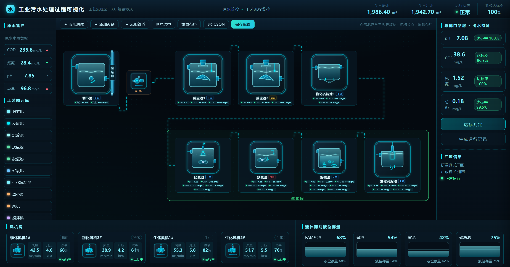

# 工艺流程编辑页（X6）· 工业污水处理过程可视化

> 面向工业污水处理场景的**工艺流程可视化 + 可编辑**大屏交互 Demo。
> 基于 AntV X6 图编辑引擎，支持工艺池体拖拽编排、动态水流线、加药管道图元、管道编辑、状态标识、点击查看双数据源历史曲线、配置保存与导出。



## 功能特性

### 工艺流程可视化大屏
- 全流程图形化展示：原水管控 → 物化段（调节池 → 离心泵 → 反应池 → 物化沉淀池）→ 生化段（厌氧池 → 缺氧池 → 好氧池 → 生化沉淀池）→ 总排口出水监测
- 顶栏（今日进出水量、运行状态、出水达标率）、左栏（原水水质 COD/氨氮/pH/流量）、风机房（物化/生化风机各 2 台）、液体药剂液位存量（PAM/碱/酸/碳源）、右栏（总排口出水监测与达标判定）
- **分区框**：仅保留生化段分区框（按最新需求删除调节池区、物化段两框），框随布局自适应

### 可编辑画布
- 从左侧「工艺图元库」点击添加池体 / 设备，节点可自由拖动
- 「＋添加池体 / 设备」弹层选择图元（池体、水泵、风机、搅拌机、曝气盘、刮泥机、加药管道等）
- 「＋添加管道」进入连线模式：点起点 → 点终点生成流动虚线；新管道**自动避让**（Manhattan 路由绕开水池/设备，在空白走廊走线，不穿越池体）
- **管道编辑**：管道只允许横线/竖线、中间可折弯；悬停后拖动**起点**只改起点、拖动**终点**只改终点（另一端不动）；点管道**中间**整体平移（起终点不变）；点选变色、× 删除
- 节点删除（选中 Delete / hover × 按钮）、重置布局、导出 JSON

### SVG 工艺图元动画
- 好氧池曝气气泡上升、立式双曲面搅拌机桨叶 3D 立体旋转、厌氧/缺氧池三叶螺旋桨（带导流罩）立体旋转、沉淀池刮泥机摆动

### 加药管道图元（新增）
- 横版 / 竖版两种形态，布置在水池上方，整体可拖动
- 单击管道上的文字（默认「药剂」）即可就地编辑名称（可自由输入，也可下拉选预设）
- 双击管道可调整纵向长短（宽度与字体不变），调整后的长短保存配置后可自动恢复

### 池体状态标识
- 每个工艺池名称旁显示状态框：蓝=正常 / 黄=异常 / 红=预警

### 池体名称就地编辑
- 双击池体名称即可改名（input + 预设清单下拉，可自由输入），保存后状态框、历史曲线标题跟随

### 点击池体查看详情
- 弹出数据抽屉，展示该池各参数（pH / ORP / NH3-N / COD / NO3- / DO / MLSS 等）的**双数据源对比曲线**
  - 青色连续曲线 = 过程监测设备（高频）
  - 橙色散点 = 化验室数据（离散上传）
  - 支持近 24 小时 / 近 7 天 / 近 30 天切换，附化验室数据对比表

### 配置保存
- 「保存配置」：将当前画布（节点/管道/分区/布局）持久化到浏览器 localStorage，下次打开自动还原
- 「导出 JSON」：将当前配置导出为 JSON 文件，可备份/迁移/二次加工

## 快速开始

纯静态页面，无需构建、无需安装依赖。

```bash
# 方式一：直接双击 index.html 用浏览器打开
# 方式二：本地起静态服务
python -m http.server 8080
# 访问 http://localhost:8080
```

> 依赖 CDN：AntV X6 v2、ECharts 5（从 jsdelivr 加载，**需联网**；内网/离线环境需将两个库下载到本地并替换 index.html 中的 script 引用）。

## 目录结构

```
智维云-工艺流程编辑Demo/
├── README.md             # 本说明文档
├── index.html            # 大屏布局 + 页面入口
├── css/
│   └── style.css         # 大屏样式（三栏布局、状态框、管道抓手、动画）
├── js/
│   ├── svg-assets.js     # SVG 工艺图元资产（池体/设备/加药管道等）
│   ├── mock-data.js      # 模拟数据：池体参数、双数据源曲线、预设名称、图元清单
│   └── app.js            # X6 画布 + 节点/连线 + 管道避障/编辑 + 分区 + 抽屉 + ECharts + 保存
└── preview/
    └── 预览-工艺流程编辑页-v18.png  # 效果预览图（README 封面）
```

## 技术栈

| 模块 | 选型 | 说明 |
| --- | --- | --- |
| 图编辑引擎 | AntV X6 v2 | 画布、节点、边、连线模式、管道抓手工具 |
| 图表 | ECharts 5 | 历史曲线（过程设备 vs 化验室双数据源） |
| 界面 | 原生 HTML + CSS + JS | 无构建步骤，便于方案快速确认 |

## 数据说明

当前为**模拟数据**（`js/mock-data.js`），种子化伪随机生成，刷新数据一致、便于演示。真实接口接入后，将 `mock-data.js` 中对应数据源替换为平台 API 即可（过程监测设备曲线 + 化验室数据曲线）。

## 版本演进

- **v19**：修复加药管道调长后的尺寸在保存配置、刷新恢复时丢失的问题（渲染时强制按节点模型尺寸同步 DOM）
- **v1**：X6 画布 + 节点 + 水流连线，点击池体弹详情抽屉，双数据源曲线对比
- **v2~v10**：三色分区框、动态水流线、SVG 动图注入、新增池体自动入分区并扩框、立体旋转叶轮、跨段折线
- **v11**：工艺池状态框（正常/异常/预警，蓝/黄/红）
- **v12**：修复连线后池体消失 bug、池体名称就地编辑
- **v13**：加药管道图元（横版）
- **v14~v16**：竖版加药管道、双击调长短、修复文字隐藏无法编辑
- **v17~v18**：管道编辑（端点拖拽/整体移动/仅横竖线）、管道避让空白走线、保存配置、删除调节池区/物化段分区框

## 声明

- 本项目为个人独立开发的**工业污水处理过程可视化**交互原型，用于工艺流程可视化方案验证与技术实践
- 页面数据均为演示用模拟数据，不代表真实水质指标

## License

MIT
